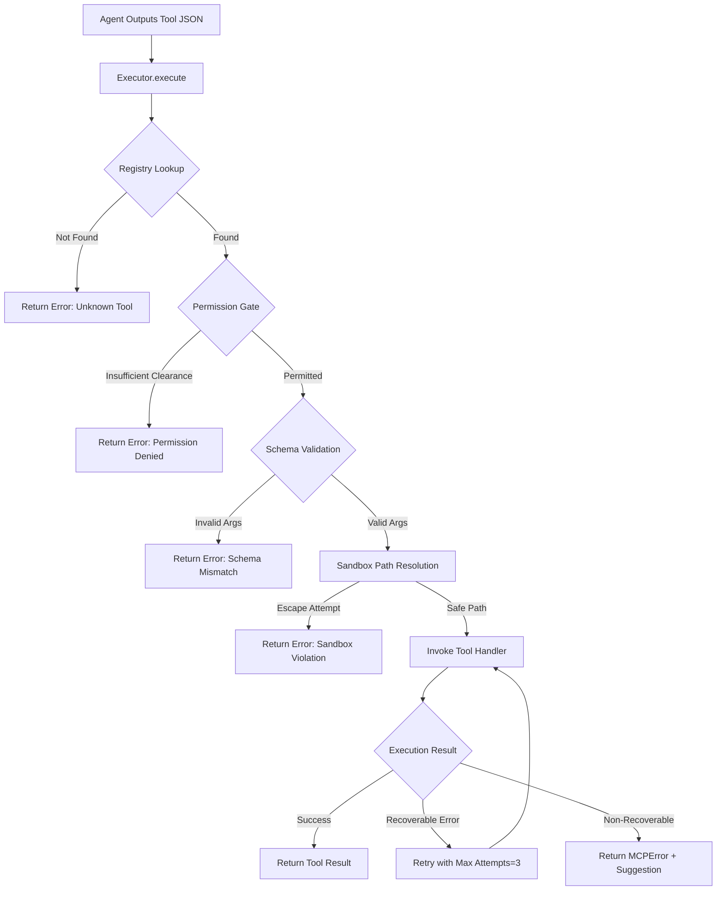

# MCP Tool Execution: Capabilities & Safety

The Model Context Protocol (MCP) is how Kotui agents interact with the real world. This document explains the execution pipeline and lists the available tools.

---

## 1. The Tool Execution Pipeline

When an agent needs to perform an action (e.g., read a file, run a command), it goes through a strict multi-stage pipeline managed by the `internal/mcp/executor.go`.

### Key Safety Mechanisms:
1.  **Permission Gate**: Every tool has a required clearance level (`Lead`, `Specialist`, or `Trial`). An agent cannot call a tool above its clearance.
2.  **Sandbox**: All file and shell operations are restricted to the project workspace root. Agents cannot access `/etc/`, `~/.ssh/`, or even their own `brain` files unless using a specific identity tool.
3.  **Sudo Gate**: Commands containing `sudo` are intercepted. If a `SudoGate` is configured, the task pauses until you click **Authorize** in the UI.
4.  **Recoverable Errors**: If a tool fails (e.g., "file not found"), the executor returns an `MCPError` with a **Suggestion**. The agent is trained to read this suggestion and retry with a corrected approach.

---

## 2. Available Tool Registry

Below are the core tools currently implemented in the Kotui engine.

### `filesystem` (Clearance: Specialist)
*   **Description**: Read, write, delete, or list files in the project workspace.
*   **Operations**: `read`, `write`, `delete`, `list`.
*   **Safety**: `delete` always creates a `.kotui_bak` backup before removing the file.

### `shell_executor` (Clearance: Specialist)
*   **Description**: Run shell commands (`sh -c`) inside the project workspace.
*   **Operations**: Executes a single `command` string.
*   **Safety**: 30-second default timeout (max 300s). `sudo` is blocked or requires manual authorization.

### `file_manager` (Clearance: Lead)
*   **Description**: High-level, read-only overview of the project structure.
*   **Operations**: 
    *   `tree`: Recursive directory listing with depth control.
    *   `stat`: Metadata for a specific file (size, modified time).
    *   `find`: Glob-based search (e.g., `*.go`) across the workspace.

### `update_self` (Clearance: Lead)
*   **Description**: The only tool allowed to modify an agent's persistent identity.
*   **Operations**: Updates `soul.md`, `persona.md`, or `skills.md`.
*   **Safety**: Requires the agent's internal `agent_id` (not display name) to prevent accidental cross-agent modification.

### `iot_gateway` (Clearance: Specialist)
*   **Description**: Interface for hardware nodes (Raspberry Pi, LoRa, etc.).
*   **Operations**:
    *   `discover`: List serial ports and configured SSH hosts.
    *   `ping`: Check TCP connectivity.
    *   `status` / `sensor_read`: Execute health or data queries via SSH.
    *   `firmware_upload` / `actuator_control`: **Requires `confirm: true`** (Boss authorization) for write operations.

### `web_search` (Clearance: Specialist)
*   **Description**: Fetch content from public URLs (documentation, API refs).
*   **Operations**: `fetch`.
*   **Safety**: Blocks private/internal IP ranges (RFC 1918). Truncates output to 4 KB and strips HTML tags.

### `project_critic` (Clearance: Lead)
*   **Description**: Static analysis and architectural review.
*   **Operations**:
    *   `lint`: Runs `go vet`, `staticcheck`, or `eslint` if available.
    *   `review`: Generates a report on file counts, lines of code, and language breakdown.
    *   `verify`: Syntax check for all Go and JSON files in the path.

### `knowledge_base` (Clearance: Specialist)
*   **Description**: Project-wide RAG (Retrieval Augmented Generation).
*   **Operations**:
    *   `index_project`: Scans the workspace and builds a vector index of all text files.
    *   `query`: Semantic search across the indexed project files.
*   **Safety**: Skips large files (>64 KB) and binary/hidden folders (`node_modules`, `.git`).

---

## 3. How Agents Use Tools

Agents do not "know" they have tools until they are injected into the system prompt. The `internal/mcp/registry.go` generates a Markdown block for the agent that looks like this:

> ## Available Tools
> To call a tool, output exactly this JSON on a single line:
> `{"tool": "filesystem", "args": {"operation": "read", "path": "main.go"}}`
> ... followed by a list of tool descriptions and parameter schemas.

This structured format ensures that even smaller models (8B) can reliably trigger tool calls without complex multi-turn handshakes.
