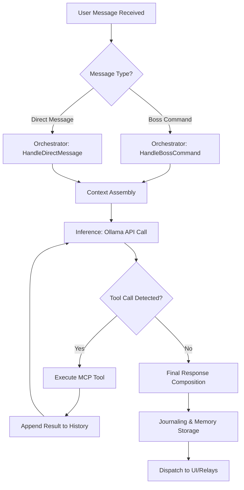
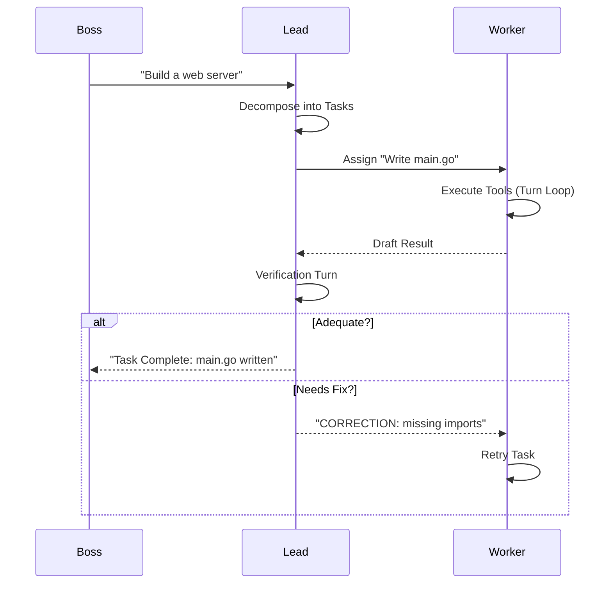

# Agent Thought Pipeline: The Lifecycle of a Message

This document details exactly what happens when you send a message to an agent in Kotui. Understanding this "pipeline" helps in providing better feedback and identifies areas where the agent's reasoning can be improved.

---

## 1. High-Level Flow

When a message arrives (either a **Boss Command** in the War Room or a **Direct Message**), the system follows a structured sequence: **Context Assembly** → **Inference** → **Agentic Loop (Tools)** → **Verification (if applicable)**.

---

## 2. Context Assembly: Building the "Brain"

Before the model is even called, Kotui assembles a massive "System Prompt" and context window. This is why agents seem to "know" who they are and what they've done before.

### 2.1 The System Prompt (The Identity)
The `internal/agent/composer.go` assembles the prompt from the following files in order:

1.  **System Identity**: A sticky header with the agent's unique ID.
2.  **Company Identity**: Vision, purpose, and values from `COMPANY_IDENTITY.md`.
3.  **Handbook**: The Standard Operating Procedures (SOP), etiquette, and the **Confidence Protocol**.
4.  **Past Experience**: Relevant snippets from previous tasks (via Vector Search).
5.  **Soul**: Core temperament and ethical leanings (`soul.md`).
6.  **Persona**: Professional role and communication style (`persona.md`).
7.  **Skills**: List of mastered tasks and the **Capability Ceiling** (`skills.md`).
8.  **Tool Definitions**: The JSON schemas for all available MCP tools.

### 2.2 Memory Recall (Vector Search)
For every message, the `internal/memory/memory.go` performs a semantic search:
*   It takes your message and generates an embedding (a numerical "fingerprint").
*   It searches the SQLite database for the top-k most similar **Journal Entries** or **Boss Feedback**.
*   These are injected into the prompt under the `## Past Experience` section.

### 2.3 Conversation History
*   **RunningAgent**: Maintains an in-memory `history` slice of the current session.
*   **Direct Messages**: History is loaded from the database (`messages` table) and appended to the prompt.
*   **Context Window Management**: Currently, the system sends the full session history. This is an area for future improvement (e.g., sliding windows).

---

## 3. The Inference & Tool Loop

Once the context is ready, the `RunningAgent.Turn` (in `internal/orchestrator/agent_loop.go`) takes over.

### 3.1 Pre-Flight Reasoning
Before acting, agents are wrapped in a "reasoning shell" (see `decomposePrompt` or `dmTurnPrompt`):
*   They are instructed to **Understand**, **Identify Identity Changes**, **Check Tools**, and **Assess Ambiguity**.
*   **Confidence Score (CS)**: The agent *must* output a JSON score (0.0 to 1.0). If CS < 0.7, the code stops the loop and asks you for clarification instead of guessing.

### 3.2 The Tool Cycle
If the agent decides it needs a tool (e.g., `read_file`, `shell_executor`):

1.  **Parsing**: The Go backend detects the specific tool JSON in the model's output.
2.  **Sandbox Check**: `internal/mcp/sandbox.go` ensures the file path isn't trying to escape the project directory.
3.  **Permission Check**: `internal/mcp/permission.go` verifies the agent's clearance (`Lead`, `Specialist`, or `Trial`).
4.  **Execution**: The tool runs, and its output (stdout or file content) is captured.
5.  **Feedback**: The result is appended to the conversation history as a "user" message, and the model is called again to analyze the results.

---

## 4. Lead-Worker Verification (War Room Only)

When the **Lead** agent assigns a task to a **Worker**, a unique verification loop occurs (`internal/orchestrator/worker.go`):

*   **Max Retries**: The Lead will try to get the Worker to fix their work up to 2 times before either accepting the best effort or failing.
*   **Approval Tokens**: The Lead specifically looks for "APPROVED" or "CORRECTION" tokens to drive this loop.

---

## 5. Persistence & Growth

After the message loop finishes:
1.  **Journaling**: The agent summarizes the task outcome into a Markdown file in its `journal/` directory.
2.  **Indexing**: The summary is embedded and stored in the vector database so it can be "recalled" in future messages.
3.  **Self-Evolution**: If the agent was instructed to change its personality or skills, it calls `update_self`, which writes back to the `soul.md` or `skills.md` files on disk.

---

## 6. How to Improve the Pipeline

Based on this architecture, here is where user feedback is most valuable:
*   **Prompt Ordering**: Does the agent prioritize the Handbook over your Direct Message? (We can re-order the composer).
*   **Confidence Thresholds**: Is 0.7 too cautious? Does the agent ask for clarification too often?
*   **Memory Relevance**: Does the "Past Experience" section actually help, or does it provide "noise"?
*   **Verification Rigour**: Is the Lead being too picky or too lazy when checking Worker output?
